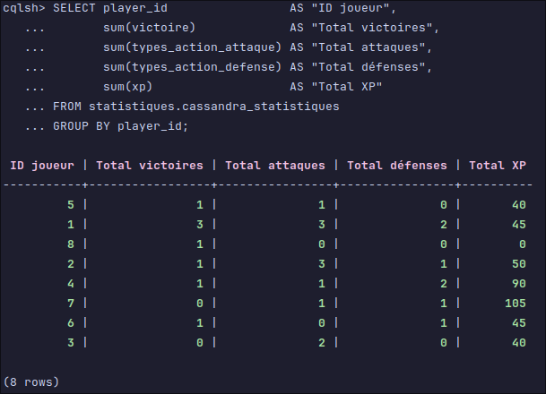
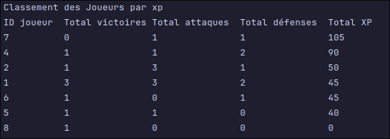
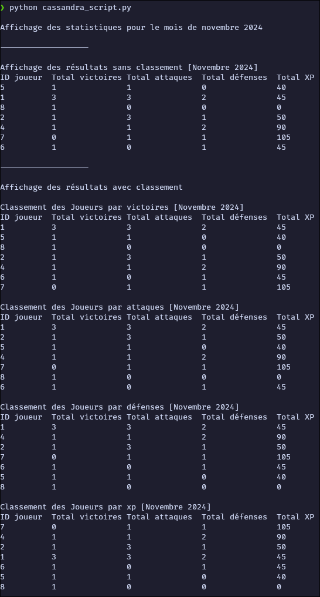

## Sommaire

- [Mise en place de l'environnement Cassandra](#mise-en-place-de-lenvironnement-cassandra)
    * [Entrer dans le container](#entrer-dans-le-container-Docker)
    * [Environment Virtuel python](#environment-virtuel-python)
    * [Execution du script python](#execution-du-script-python)
- [Utilisation de la base de données Cassandra NoSQL](#utilisation-de-la-base-de-données-cassandra-nosql)
- [Modèle de Données](#modèle-de-données)
- [Exigences techniques](#exigences-techniques)
    * [Contraintes de charge](#contraintes-de-charge)
    * [Pourquoi Cassandra DB](#pourquoi-cassandra-db)
    * [Keyspace](#keyspace)
    * [Table des Statistiques des Joueurs](#table-des-statistiques-des-joueurs)
    * [Colonnes principales](#colonnes-principales)
    * [Exemple de Données](#exemple-de-données)
    * [Opérations CRUD](#opérations-crud)
    * [Indexation](#indexation)
    * [Requêtes d’Agrégation pour les Classements](#requêtes-dagrégation-pour-les-classements)
- [Fonctionnalités de Classement](#fonctionnalités-de-classement)
    * [Utilisation du script Python](#utilisation-du-script-python)
    * [Connection à la base de données Cassandra](#connection-à-la-base-de-données-cassandra)
    * [Définition de la période de temps](#définition-de-la-période-de-temps)
    * [Requête pour les Classements](#requête-pour-les-classements)
    * [Tri des résultats](#tri-des-résultats)
- [Résultat final de l'execution du script Python](#résultat-final-de-lexecution-du-script-python)

## Mise en place de l'environnement Cassandra

### Entrer dans le container Docker

```bash
docker exec -it cassandra cqlsh
```

### Environment Virtuel python

La mise en place de l'environnement virtuel python nécessaire pour l'execution du script python.
*Le development de l'application a été fait sur Linux, il est possible que les commandes diffèrent sur Windows.*

**Sur linux**

```bash
python -m venv .venv &&
source .venv/bin/activate &&
pip install --upgrade pip &&
pip install cassandra-driver
```

**Sur Windows**

```bash
python -m venv .venv &&
.venv\Scripts\activate.bat &&
pip install --upgrade pip &&
pip install cassandra-driver
```

**Pour désactiver l'environnement virtuel**

```bash
deactivate
```

#### Execution du script python

```bash
python cassandra_script.py
```

*Dans le repertoire Cassandra*

## Utilisation de la base de données Cassandra NoSQL

### Modèle de Données

Fichier data.cql :


### Exigences techniques

#### Contraintes de charge

Les statistiques des joueurs sont stockées pour une analyse mondiale des performances et des classements. Des volumes
massifs sont à prévoir, avec un pic de charge pouvant atteindre jusqu’à 200 000 requêtes par seconde lors des événements
de mise à jour de classements ou de récompenses.

Les données sont stockées pour chaque joueur, incluant ses actions et gains d’expérience. Les statistiques sont
enregistrées en temps réel de manière à suivre l’évolution des performances des joueurs.

Des classements doivent être générés et consultable pour chaque type d’action (attaques, défenses, victoires, xp) sur
une
période donnée.

Ses données sont critiques, et doivent être stockées de manière fiable pour garantir l’intégrité des classements et des
statistiques.

####  Pourquoi Cassandra DB

Le Pic de charge pouvant atteindre jusqu’à 200 000 requêtes par seconde lors des événements de mise à jour de
classements ou de récompenses pour une analyse mondial. Cassandra est très adapté à ce genre de contrainte à condition
d’avoir un minimum de nœuds (une vingtaine) dans le cluster. Grâce à sa flexibilité sans schéma, Cassandra DB pourra
aussi absorber la
quantité d’informations à stocker (600 millions d’entrées de statistiques par mois), et Cassandra est très performant
pour les opérations de lecture et d'écriture massives.

C'est également une base de données NoSQL distribuée, avec une tolérante aux pannes et hautement évolutive, idéale pour
stocker des données de jeu massives et critiques,
sans avoir à définir à l'avance la structure de la base de données.

Il y a également la possibilité de faire des requêtes d'agrégation pour obtenir des classements de joueurs par période
et par type d’action.

En résumer, Cassandra DB est un choix judicieux car :

- Il est conçu pour gérer des charges de travail massives.
- Il est tolérant aux pannes et hautement évolutif.
- Il est flexible sans schéma, idéal pour les jeux vidéo en constante évolution.
- Il est performant pour les opérations de lecture et d'écriture massives.
- Il permet des requêtes d'agrégation pour obtenir des classements de joueurs.

Quelques points négatifs à noter :

- Il est difficile de faire des requêtes complexes à cause du modèle sans schémas.
- Il n'est pas adapté pour les requêtes de type JOIN.
- Il nécessite une infrastructure de matériel robuste pour supporter les charges de travail à grande échelle, et donc
  potentiellement plus coûteuse.

#### Keyspace

Le *keyspace* statistiques est configuré avec une stratégie de réplication simple pour une répartition équilibrée des
données dans un environnement de développement.

```sql
CREATE KEYSPACE IF NOT EXISTS statistiques
            WITH REPLICATION = { 'class' : 'SimpleStrategy', 'replication_factor' : 1 };
```

#### Table des Statistiques des Joueurs

La table cassandra_statistiques dans le keyspace statistiques enregistre chaque événement en jeu d’un joueur, incluant
ses actions et gains d’expérience. La conception est optimisée pour des lectures rapides via le partitionnement sur
player_id.

```sql
CREATE TABLE IF NOT EXISTS statistiques.cassandra_statistiques
(
    id                   UUID,
    player_id            int,
    xp                   int,
    types_action_attaque int,
    types_action_defense int,
    victoire             int,
    timestamp_evenement  timestamp,
    PRIMARY KEY (player_id, id)
);
```

#### Colonnes principales :

- **player_id** : Identifiant unique du joueur.
- **id** : UUID de l'événement, utilisé pour garantir l'unicité et trier les événements par ordre chronologique.
- **types_action_attaque, types_action_defense, victoire** : Enregistre le type d’action effectuée par le joueur.
- **xp** : Points d’expérience gagnés lors de l’événement.
- **timestamp_evenement** : Date et heure de l’événement pour suivre les actions dans le temps.
- **PRIMARY KEY permettent** : de récupérer les valeurs pour faire le classement lors de la requête.

#### Exemple de Données

Insertion de données de test pour des joueurs avec la totalité des actions :

```sql
INSERT INTO statistiques.cassandra_statistiques
(id, player_id, types_action_attaque, types_action_defense, victoire, timestamp_evenement)
VALUES (uuid(), 1, 0, 1, 1, '2024-11-06 12:00:00');
```

Insertion de données de test pour les joueurs avec des actions variées (ici seulement le type d’action attaque) :s

```sql
INSERT INTO statistiques.cassandra_statistiques
    (id, player_id, types_action_attaque, timestamp_evenement)
VALUES (uuid(), 1, 1, '2024-11-06 12:00:00');
```

*Dans un cas réel, le timestamp_evenement sera surement* **toTimestamp(now())**

#### Opérations CRUD

• **Création / Insertion** : Les événements sont ajoutés pour chaque joueur avec un UUID généré aléatoirement.
• **Suppression** : Suppression des données d’un joueur spécifique (ex : player_id = 2).

 ```sql
 DELETE
 FROM statistiques.cassandra_statistiques
 WHERE player_id = 2;
 ```

• **Lecture** : Les données sont lues pour obtenir les statistiques d’un joueur spécifique (ex : player_id = 1).

  ```sql
  SELECT *
  FROM statistiques.cassandra_statistiques
  WHERE player_id = 1;
  ```

• **Mise à jour** : Mise à jour des données d’un joueur spécifique (ex : player_id = 1).

 ```sql
 UPDATE statistiques.cassandra_statistiques
 SET xp = 100
 WHERE player_id = 1;
 ```

#### Indexation

L’indexation des données est essentielle pour accélérer les requêtes de recherche.
Un index est créé sur le champ timestamp_evenement pour accélérer les requêtes de recherche par date.

```sql
CREATE INDEX IF NOT EXISTS timestamp_evenement_idx ON statistiques.cassandra_statistiques (timestamp_evenement);
```

#### Requêtes d’Agrégation pour les Classements

L’analyse des données s’effectue par des requêtes d’agrégation pour obtenir des classements de joueurs par période et
par type d’action. Ces classements sont essentiels pour suivre l’engagement et les performances des joueurs.
Exemple de Requête pour les Totaux d’Actions et d’Expérience par Joueur

```sql
SELECT player_id                 AS "ID joueur",
       sum(victoire)             AS "Total victoires",
       sum(types_action_attaque) AS "Total attaques",
       sum(types_action_defense) AS "Total défenses",
       sum(xp)                   AS "Total XP"
FROM statistiques.cassandra_statistiques
GROUP BY player_id;
```

Ce qui nous donne :

*Ensembles des informations brut utilisées*

Le joueur d'ID 3 a volontairement des données en dehors du mois de novembre 2024 pour montrer l'efficacité de la requête
de filtrage.


*Moyennes des informations pour chaques joueurs*



## Fonctionnalités de Classement

Un script sera exécuté pour générer les classements selon les totaux d’actions pour chaque joueur (attaques,
défenses, victoires, xp). Les requêtes permettent de :
• Obtenir les meilleurs scores par type d’action.
• Filtrer les données par période via timestamp_evenement pour des périodes spécifiques (ici le mois de novembre 2024).

### Utilisation du script Python

#### Connection à la base de données Cassandra

L'installation de la librairie cassandra-driver est nécessaire pour la connexion à la base de données.

```python
from cassandra.cluster import Cluster

# Configuration de la connexion
cluster = Cluster(['127.0.0.1'])  # Le serveur Cassandra tourne sur le localhost depuis le container docker
session = cluster.connect('statistiques')  # Connection au keyspace statistiques
```

#### Définition de la période de temps

La période de temps pour les classements est définie ici pour le mois de novembre 2024.

```python
# Période de temps pour les statistiques (ici le mois de novembre 2024)
start_date = datetime(2024, 11, 1, 0, 0, 0)
end_date = datetime(2024, 12, 1, 0, 0, 0)
```

#### Requête pour les Classements

Les requêtes pour les classements sont exécutées pour obtenir les totaux d’actions par joueur et par type d’action.
L'option ALLOW FILTERING est utilisée pour autoriser les requêtes de filtrage sur les colonnes non indexées.

```python
query = """
SELECT player_id                 AS "ID joueur",
       sum(victoire)             AS "Total victoires",
       sum(types_action_attaque) AS "Total attaques",
       sum(types_action_defense) AS "Total défenses",
       sum(xp)                   AS "Total XP"
FROM cassandra_statistiques
WHERE timestamp_evenement >= %s AND timestamp_evenement <= %s
GROUP BY player_id
ALLOW FILTERING;
"""
```

#### Tri des résultats

Le tri des résultats est effectué pour obtenir le classement par type d’action. (ici les point d'expérience) :

```python
print("Classement des Joueurs par xp")
rows = session.execute(query, (start_date, end_date))
sorted_rows_xp = sorted(rows, key=lambda row: row[4], reverse=True)

print(f"{'ID joueur':<10} {'Total victoires':<15} {'Total attaques':<15} {'Total défenses':<15} {'Total XP':<10}")
for row in sorted_rows_xp:
    print(f"{row[0]:<10} {row[1]:<15} {row[2]:<15} {row[3]:<15} {row[4]:<10}")
```

- *rows* contient les résultats de la requête dans la plage du mois de novembre 2024
- *sorted_rows_xp* contient les résultats triés par ordre décroissant des points d’expérience (sur la colonne d'id 4).
- Les résultats sont affichés avec les totaux d’actions pour chaque joueur.

Ce qui donne :

*Comme prévu, le joueur d'ID 3 n'apparait pas, car en avec sans statistiques en novembre*



## Résultat final de l'execution du script Python




