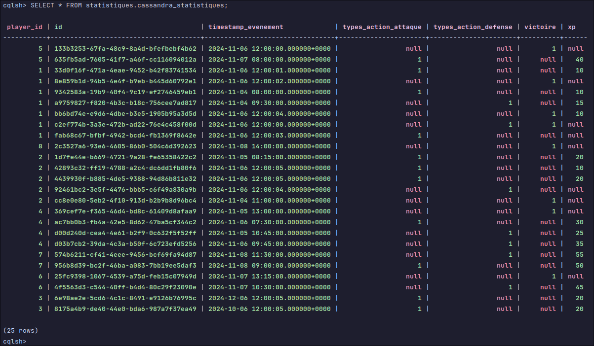

## Mise en place de l'environnement Cassandra

### Entrer dans le container

```bash
docker exec -it cassandra cqlsh
```

### Environment Virtuel python

*Le development de l'application a été fait sur Linux, il est possible que les commandes diffèrent sur Windows.*

**Sur linux**
```bash
python -m venv .venv &&
source .venv/bin/activate &&
pip install --upgrade pip &&
pip install cassandra-driver
```

**Sur Windows**
```bash
python -m venv .venv &&
.venv\Scripts\activate.bat &&
pip install --upgrade pip &&
pip install cassandra-driver
```

**Pour désactiver l'environnement virtuel**
```bash
deactivate
```

#### Execution du script python

```bash
python cassandra_script.py
```
*Dans le repertoire Cassandra*

## Utilisation de la base de données Cassandra NoSQL

### Modèle de Données
   Fichier data.cql :


#### Keyspace
Le *keyspace* statistiques est configuré avec une stratégie de réplication simple pour une répartition équilibrée des données dans un environnement de développement.

```sql
CREATE KEYSPACE IF NOT EXISTS statistiques 
WITH REPLICATION = { 'class' : 'SimpleStrategy', 'replication_factor' : 1 };
```

#### Table des Statistiques des Joueurs

La table cassandra_statistiques dans le keyspace statistiques enregistre chaque événement en jeu d’un joueur, incluant ses actions et gains d’expérience. La conception est optimisée pour des lectures rapides via le partitionnement sur player_id.

```sql
CREATE TABLE IF NOT EXISTS statistiques.cassandra_statistiques
(
    id                   UUID,
    player_id            int,
    xp                   int,
    types_action_attaque int,
    types_action_defense int,
    victoire             int,
    timestamp_evenement  timestamp,
    PRIMARY KEY (player_id, id)
);
```

#### Colonnes principales :

• player_id : Identifiant unique du joueur.
• id : UUID de l'événement, utilisé pour garantir l'unicité et trier les événements par ordre chronologique.
• types_action_attaque, types_action_defense, victoire : Enregistre le type d’action effectuée par le joueur.
• xp : Points d’expérience gagnés lors de l’événement.
• timestamp_evenement : Date et heure de l’événement pour suivre les actions dans le temps.

#### Exemple de Données

Insertion de données de test pour des joueurs avec la totalité des actions :

```sql
INSERT INTO statistiques.cassandra_statistiques
    (id, player_id, types_action_attaque, types_action_defense, victoire, timestamp_evenement)
VALUES (uuid(), 1, 0, 1, 1, '2024-11-06 12:00:00');
```

Insertion de données de test pour les joueurs avec des actions variées (ici seulement le type d’action attaque) :s
```sql
INSERT INTO statistiques.cassandra_statistiques
    (id, player_id, types_action_attaque, timestamp_evenement)
VALUES (uuid(), 1, 1, '2024-11-06 12:00:00');
```
*Dans un cas réel, le timestamp_evenement sera surement* **toTimestamp(now())**

#### Opérations CRUD
   • **Création / Insertion** : Les événements sont ajoutés pour chaque joueur avec un UUID généré aléatoirement.
   • **Suppression** : Suppression des données d’un joueur spécifique (ex : player_id = 2).
 ```sql
 DELETE FROM statistiques.cassandra_statistiques WHERE player_id = 2;
 ```

   • **Lecture** : Les données sont lues pour obtenir les statistiques d’un joueur spécifique (ex : player_id = 1).
  ```sql
  SELECT * FROM statistiques.cassandra_statistiques WHERE player_id = 1;
  ```

   • **Mise à jour** : Mise à jour des données d’un joueur spécifique (ex : player_id = 1).
 ```sql
 UPDATE statistiques.cassandra_statistiques SET xp = 100 WHERE player_id = 1;
 ```

*partie ci-dessous à supprimer peut etre*
#### Indexation
L’indexation des données est essentielle pour accélérer les requêtes de recherche. 
Un index est créé sur le champ timestamp_evenement pour accélérer les requêtes de recherche par date.

```sql
CREATE INDEX IF NOT EXISTS timestamp_evenement_idx ON statistiques.cassandra_statistiques (timestamp_evenement);
```

#### Requêtes d’Agrégation pour les Classements
L’analyse des données s’effectue par des requêtes d’agrégation pour obtenir des classements de joueurs par période et par type d’action. Ces classements sont essentiels pour suivre l’engagement et les performances des joueurs.
Exemple de Requête pour les Totaux d’Actions et d’Expérience par Joueur

```sql
SELECT player_id                 AS "ID joueur",
       sum(victoire)             AS "Total victoires",
       sum(types_action_attaque) AS "Total attaques",
       sum(types_action_defense) AS "Total défenses",
       sum(xp)                   AS "Total XP"
FROM statistiques.cassandra_statistiques
GROUP BY player_id;
```

Ce qui nous donne :

*Ensembles des informations brut utilisées*



*Moyennes des informations pour chaques joueurs*


7. Fonctionnalités de Classement
   Un script sera exécuté pour générer les classements selon les totaux d’actions pour chaque joueur (attaques, défenses, victoires, xp). Les requêtes permettent de :
   • Obtenir les meilleurs scores par type d’action.
   • Filtrer les données par période via timestamp_evenement pour des périodes spécifiques (ex : les 30 derniers jours).
