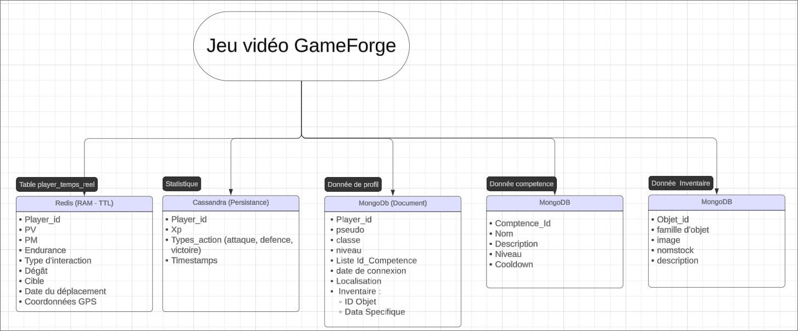

# Projet NoSQL Gameforge - Cassandra, MongoDB, Redis

Projet mis en place pour le cours de NoSQL de Mr Soltani dans le cadre du master CPIL à l'IPI

## Sommaire

* [Contexte](#contexte)
    * [Cahier des charges](#cahier-des-charges)
    * [Objectif](#objectif)
    * [Schéma de la base de données](#schéma-de-la-base-de-données)
* [Mise en place de l'environnement](#mise-en-place-de-lenvironnement)
    * [Prérequis](#prérequis)
    * [Lancer le container Docker](#lancer-le-container-docker)
    * [Arrêter le container Docker](#arrêter-le-container-docker)
* [Utilisation des différentes bases de données](#utilisation-des-différentes-bases-de-données)
    * [CassandraDB : affichage des statistiques et classements des joueurs](#cassandradb--affichage-des-statistiques-et-classements-des-joueurs)
    * [REDIS](#redis)
    * [MONGODB](#mongodb)

## Contexte

### Cahier des charges

GameForge est un jeu vidéo MMO en temps réel, accueillant une communauté active et internationale de joueurs. Le jeu
exige une infrastructure capable de gérer des milliers de joueurs simultanés, avec des interactions complexes en temps
réel, des inventaires évolutifs, et des statistiques de performance pour des classements dynamiques.

### Objectif

Concevoir une architecture multi-base NoSQL cConcevoir une architecture multi-base NoSQL capable de :

- Gérer efficacement les profils de joueurs et leurs inventaires.
- Assurer une réactivité optimale pour les interactions en temps réel entre les joueurs.
- Permettre des analyses de statistiques et de classements en continu pour des décisions de gameplay et de progression.

### Schéma de la base de données



- **Cassandra** : affichage des statistiques et classements des joueurs sur le mois de novembre 2024. [Lien vers la documentation Cassandra](Cassandra/README.md)
- **MongoDB** : gestion des profils de joueurs et de leurs inventaires. [Lien vers la documentation MongoDB](MongoDB/README.md)
- **Redis** : gestion des interactions en temps réel entre les joueurs. [Lien vers la documentation Redis](Redis/README.md)

## Mise en place de l'environnement

*Pour travailler de manière efficace, nous avons opté pour un container Docker qui héberge les différentes technologie
NoSQL*

### Prérequis

- Docker
- Docker-compose
- Python 3
- Pip

### Lancer le container Docker

```bash
docker compose up -d
```

*La commande lancera un serveur Cassandra, MongoDB et Redis, sur leur port par défaut*

### Arrêter le container Docker

```bash
docker compose down
```

## Utilisation des différentes bases de données

*Chaques partie est expliquée dans un fichier README.md dans le répertoire de la base de données correspondante.*

### CassandraDB : affichage des statistiques et classements des joueurs

Le code Python est dans le fichier `Cassandra/cassandra_script.py` et le fichier `Cassandra/data.cql` contient le modèle de données.
La mise en place, l'utilisation et le code produit est détaillé dans le fichier `Cassandra/README.md` du répertoire Cassandra.

[Lien vers la documentation Cassandra](Cassandra) (Partie Alvin KITA)

### MONGODB

[Lien vers la documentation MongoDB](MongoDB) (Partie RemiP79)

### REDIS

[Lien vers la documentation Redis](Redis) (Partie mistheo)
