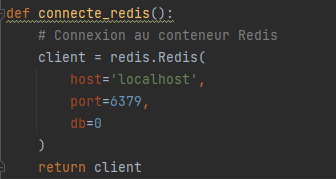
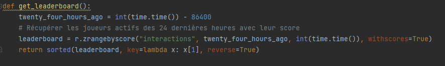
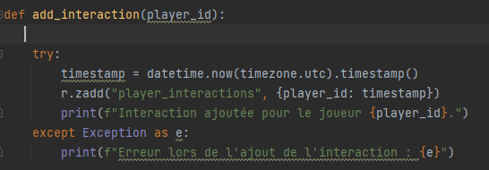
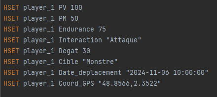
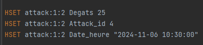
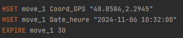
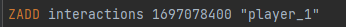

Fiche Technique : Gestion des Interactions de Jeu en Temps Réel

1. Objectif du Module
   Assurer le traitement et la gestion des interactions de jeu en temps réel, notamment les combats, mouvements, et échanges d’objets, en garantissant des performances optimales grâce à une base de données NoSQL (Redis). Ce module supporte des charges élevées et permet un suivi des classements des joueurs actifs sur 24 heures.

2. Données Manipulées

a. Données d’interactions
1. Combat (attack) :  
Format : attack:<attacker_id>:<target_id>  
•   Dégâts infligés
•   Identifiant unique de l'attaque
•   Horodatage UTC (date/heure)

    2. Déplacement (move) :  
  	Format : move:<player_id>
    •   Coordonnées GPS
    •   Horodatage UTC (date/heure)
    •   Durée de vie (TTL) : Entre 10 et 60 secondes pour les actions temporaires.  

b. Données de base des joueurs (player)
•  Points de vie (PV), points de mana (PM), endurance, interaction en cours, dégâts infligés, cible visée, coordonnées GPS et dernières actions.

c. Données de classement
•  Classement des joueurs actifs (sur 24 heures) basé sur un système de *sorted sets* dans Redis.

3. Charges Attendues
   • Nombre total d’interactions : 20 millions/jour.
   • Charge moyenne : 70 000 interactions/seconde.
   • Pic maximal : 175 000 interactions/seconde (événements de groupe).

4. Fonctionnalités Clés

a. Stockage et gestion des interactions en temps réel
• Combats: Enregistrement instantané des attaques avec stockage des détails (attaquant, cible, dégâts, horodatage).  
• Déplacements : Mise à jour en temps réel des coordonnées GPS avec gestion de la durée de vie des données via TTL.

b. Classements en direct
•  Utilisation de *sorted sets* Redis pour compter les interactions de chaque joueur sur une période glissante de 24 heures.  
• Actualisation automatique : suppression des interactions dépassant 24 heures grâce à `zremrangebyscore`.

5. Structure des Fichiers Python
1. connecte.py
    - Fonctionnalité : Connexion au serveur Redis et récupération des données associées à une clé.
- Exemple de méthode clé :

2. leaderboard.py
    - Fonctionnalités :  
      •      Ajouter une interaction avec un horodatage UNIX (zadd).  
      •      Nettoyer les interactions de plus de 24 heures (zremrangebyscore).  
      •       Récupérer les joueurs les plus actifs avec leurs scores, triés par ordre décroissant (zrangebyscore).
    - Exemple de méthode clé :

3. main.py
    - Fonctionnalités :  
      •     Stockage des attaques (hset).  
      •      Suivi des mouvements avec coordonnées GPS et TTL.  
      •      Gestion des classements en direct via `add_interaction`, `cleanup_old_interactions`, et `get_leaderboard`.
    - Exemple de méthode clé :

6. Base de Données Redis : Structure
   a.Ajout joueur:

b. Combat

c. Déplacement

d. Classements

7. Points Techniques Clés
   • Redis comme base de données NoSQL :  
   Utilisation de structures comme Hashes, Sorted Sets et gestion du TTL.  
   • Performance :
- Gestion efficace des charges élevées via Redis, optimisé pour des opérations rapides en mémoire.
- Suppression périodique des données obsolètes pour garantir des performances constantes.  
  • Évolutivité :  
  Préparé pour des charges importantes grâce à l'optimisation des structures et à l'adoption d’une base NoSQL hautement performante.

8. Avantages de l'Approche
   •  Rapidité et faible latence grâce à Redis.
   • Gestion efficace des actions éphémères avec TTL.
   • Suivi des joueurs actifs et classement en temps réel.

